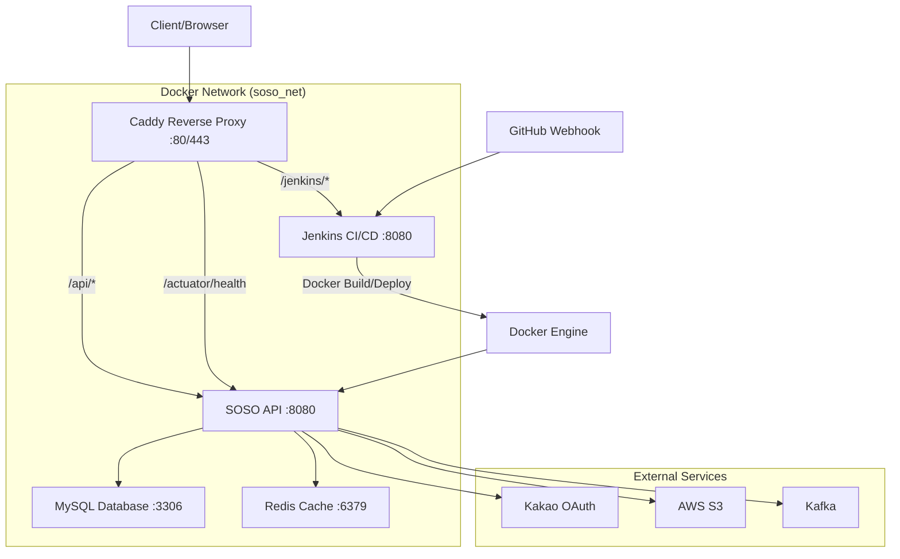

# 🚀 SOSO Server

현대화된 Spring Boot 기반 소셜 미디어 플랫폼 서버

## 📋 목차

- [개요](#개요)
- [아키텍처](#아키텍처)
- [빠른 시작](#빠른-시작)
- [배포](#배포)
- [인프라 관리](#인프라-관리)
- [개발 가이드](#개발-가이드)
- [API 문서](#api-문서)

## 🎯 개요

SOSO Server는 현대적인 마이크로서비스 아키텍처를 기반으로 한 소셜 미디어 플랫폼입니다.

### 주요 기능

- 🔐 **사용자 인증**: JWT 기반 인증 및 OAuth (Kakao)
- 📱 **소셜 기능**: 게시글, 댓글, 좋아요 시스템
- 🚀 **실시간 알림**: WebSocket 기반 실시간 알림
- 📊 **모니터링**: Spring Boot Actuator 헬스체크
- 🐳 **컨테이너화**: Docker & Docker Compose
- 🔄 **CI/CD**: Jenkins 기반 자동 배포

## 🏗️ 시스템 아키텍처



### 서비스 구성 및 네트워킹

| 서비스       | 컨테이너     | 포트        | 도메인 경로                | 역할                     |
| ------------ | ------------ | ----------- | -------------------------- | ------------------------ |
| **Proxy**    | `soso-proxy` | 80, 443     | soso.dreampaste.com        | Caddy 리버스 프록시      |
| **API**      | `soso-api`   | 8080 (내부) | /api/*, /actuator/*        | Spring Boot 애플리케이션 |
| **CI/CD**    | `jenkins`    | 8080 (외부) | /jenkins/*                 | Jenkins 자동화           |
| **Database** | `soso-mysql` | 3306 (내부) | -                          | MySQL 8.4 데이터베이스   |
| **Cache**    | `soso-redis` | 6379 (내부) | -                          | Redis 캐시               |

### 도메인 라우팅 구성

#### 메인 도메인: `soso.dreampaste.com`
- **API 서비스**: `/api/*` → `soso-api:8080`
- **헬스체크**: `/actuator/*` → `soso-api:8080`
- **Jenkins**: `/jenkins/*` → `jenkins:8080`
- **SSL**: 자동 Let's Encrypt 인증서

## ⚡ 빠른 시작

### 1. 사전 요구사항

- Docker & Docker Compose
- Git
- Java 17+ (개발용)

### 2. 환경 설정

```bash
# 1. 레포지토리 클론
git clone https://github.com/B2A5/SOSO-Server.git
cd SOSO-Server

# 2. 환경변수 설정
cp .env.example .env
# .env 파일을 편집하여 실제 값들을 입력하세요

# 3. 인프라 시작 (개발용)
docker compose -f compose-dev.yml up -d

# 4. 애플리케이션 로컬 실행
./gradlew bootRun
```

### 3. 접속 확인

- **API 문서**: http://localhost:8080/swagger-ui/
- **MySQL**: localhost:3307
- **Redis**: localhost:6379

## 🚀 배포

### 프로덕션 배포

#### 자동 배포 (Git Push)

```bash
# 메인 브랜치에 푸시하면 자동 배포
git push origin main
```

#### 수동 배포

```bash
# 배포 스크립트 실행
./infrastructure/scripts/deploy.sh production
```

### 배포 프로세스

1. **테스트 실행**: Unit 테스트 및 통합 테스트
2. **빌드**: Spring Boot JAR 파일 생성
3. **Docker 이미지**: 애플리케이션 이미지 빌드
4. **무중단 배포**: 헬스체크 기반 롤링 업데이트
5. **검증**: 서비스 상태 및 엔드포인트 확인

## 🛠️ 인프라 관리

### 현대화된 Git 기반 인프라

모든 인프라 구성은 Git으로 관리되며, `git push`만으로 서버 인프라를 업데이트할 수 있습니다:

- **compose.yml**: 통합된 Docker Compose 설정
- **infrastructure/Caddyfile**: Git으로 관리되는 리버스 프록시 설정
- **Jenkinsfile**: Docker Compose 기반 CI/CD 파이프라인
- **infrastructure/scripts/**: 자동화된 관리 스크립트

### 관리 명령어

```bash
# 시스템 상태 확인
./infrastructure/scripts/manage.sh status

# 서비스 로그 확인
./infrastructure/scripts/manage.sh logs api 100

# 백업 생성
./infrastructure/scripts/manage.sh backup

# 서비스 재시작
./infrastructure/scripts/manage.sh restart api

# 시스템 정리
./infrastructure/scripts/manage.sh cleanup

# 실시간 모니터링 (5분간)
./infrastructure/scripts/manage.sh monitor 300
```

### 헬스체크 및 모니터링

```bash
# API 헬스체크
curl https://soso.dreampaste.com/actuator/health

# Jenkins 접속 확인
curl https://soso.dreampaste.com/jenkins/

# Swagger API 문서
curl https://soso.dreampaste.com/swagger-ui/
```

### 자동 배포 파이프라인

1. **Git Push** → GitHub 저장소에 코드 푸시
2. **Webhook Trigger** → Jenkins가 자동으로 빌드 시작
3. **Test & Build** → 테스트 실행 후 Docker 이미지 빌드
4. **Zero-Downtime Deploy** → 헬스체크 기반 무중단 배포
5. **Verification** → 배포 완료 후 서비스 상태 검증

## 👨‍💻 개발 가이드

### 로컬 개발 환경

```bash
# 개발용 인프라 시작 (DB, Redis만)
docker compose -f compose-dev.yml up -d

# 애플리케이션 개발 모드 실행
./gradlew bootRun --args='--spring.profiles.active=dev'

# 테스트 실행
./gradlew test

# 코드 포맷팅
./gradlew spotlessApply
```

### 브랜치 전략

- `main`: 프로덕션 배포 브랜치
- `dev`: 개발 통합 브랜치
- `feature/*`: 기능 개발 브랜치

### 커밋 컨벤션

```
feat: 새로운 기능 추가
fix: 버그 수정
docs: 문서 수정
style: 코드 포맷팅
refactor: 코드 리팩토링
test: 테스트 추가/수정
chore: 빌드 관련 수정
```

## 📚 API 문서

### 접속 URL

- **Swagger UI**: https://soso.dreampaste.com/swagger-ui/
- **OpenAPI Spec**: https://soso.dreampaste.com/v3/api-docs

### 주요 엔드포인트

#### 🔐 인증/회원가입 API
| 기능           | Method | Endpoint                     | 설명                                    |
| -------------- | ------ | ---------------------------- | --------------------------------------- |
| 카카오 로그인  | POST   | `/auth/kakao/login`          | 카카오 OAuth 로그인                     |
| 토큰 재발급    | POST   | `/auth/refresh`              | Refresh Token으로 Access Token 재발급   |

#### 👤 회원가입 단계별 API
| 단계           | Method | Endpoint                     | 설명                                    |
| -------------- | ------ | ---------------------------- | --------------------------------------- |
| 1단계          | POST   | `/signup/user-type`          | 사용자 유형 설정 (예비창업자/일반거주민) |
| 2단계          | POST   | `/signup/region`             | 지역 설정                               |
| 3단계          | POST   | `/signup/age-range`          | 연령대 설정                             |
| 4단계          | POST   | `/signup/gender`             | 성별 설정                               |
| 5단계*         | POST   | `/signup/interests`          | 관심업종 설정 (예비창업자 전용)         |
| 6단계*         | POST   | `/signup/budget`             | 예산 설정 (예비창업자 전용)             |
| 7단계*         | POST   | `/signup/experience`         | 창업 경험 설정 (예비창업자 전용)        |
| 8단계          | POST   | `/signup/nickname`           | 닉네임 자동 생성                        |
| 9단계          | POST   | `/signup/complete`           | 회원가입 완료 및 JWT 토큰 발급          |

#### 📝 자유게시판 API
| 기능           | Method | Endpoint                               | 설명                                    |
| -------------- | ------ | -------------------------------------- | --------------------------------------- |
| 게시글 목록    | GET    | `/community/freeboard`                | 커서 기반 게시글 목록 조회              |
| 게시글 생성    | POST   | `/community/freeboard`                | 새 게시글 작성 (이미지 업로드 지원)     |
| 게시글 조회    | GET    | `/community/freeboard/{id}`           | 게시글 상세 조회                        |
| 게시글 수정    | PATCH  | `/community/freeboard/{id}`           | 게시글 수정                             |
| 게시글 삭제    | DELETE | `/community/freeboard/{id}`           | 게시글 소프트 삭제                      |
| 좋아요 토글    | POST   | `/community/freeboard/{id}/like`      | 게시글 좋아요 추가/취소                 |
| 좋아요 상태    | GET    | `/community/freeboard/{id}/like`      | 좋아요 상태 확인                        |

#### 💬 댓글 API
| 기능           | Method | Endpoint                                      | 설명                              |
| -------------- | ------ | --------------------------------------------- | --------------------------------- |
| 댓글 목록      | GET    | `/community/freeboard/{id}/comments`         | 커서 기반 댓글 목록 조회          |
| 댓글 작성      | POST   | `/community/freeboard/{id}/comments`         | 댓글/대댓글 작성                  |
| 댓글 수정      | PATCH  | `/community/freeboard/{id}/comments/{cId}`   | 댓글 수정                         |
| 댓글 삭제      | DELETE | `/community/freeboard/{id}/comments/{cId}`   | 댓글 소프트 삭제                  |
| 댓글 좋아요    | POST   | `/community/freeboard/{id}/comments/{cId}/like` | 댓글 좋아요 토글               |

*예비창업자 전용 단계

### 인증

API 요청 시 헤더에 JWT 토큰 포함:

```bash
Authorization: Bearer <your-jwt-token>
```

## 🔧 설정

### 환경변수 구성

프로덕션 환경에서는 `.env` 파일을 통해 환경변수를 관리합니다:

```bash
# Application Configuration
SPRING_PROFILES_ACTIVE=prod
API_IMAGE=localtest/soso-server:latest

# Database Configuration (MySQL)
MYSQL_ROOT_PASSWORD=your-secure-root-password
DB_NAME=soso
DB_USER=soso_user
DB_PASS=your-secure-db-password

# JWT Configuration
JWT_SECRET=your-super-secure-jwt-secret-key-at-least-256-bits
JWT_AT_VALIDITY=1800000    # Access Token 30분
JWT_RT_VALIDITY=1209600000 # Refresh Token 14일

# Frontend Configuration
FRONTEND_ORIGIN=https://soso.dreampaste.com

# OAuth Configuration (Kakao)
KAKAO_CLIENT_ID=your-kakao-client-id
KAKAO_REDIRECT_URIS=https://soso.dreampaste.com/auth

# AWS Configuration (S3)
AWS_REGION=ap-northeast-2
AWS_S3_BUCKET=your-s3-bucket-name
S3_BASE_URL=https://your-s3-bucket-name.s3.ap-northeast-2.amazonaws.com

# External Services
KAFKA_BOOTSTRAP=your-kafka-bootstrap-servers
```

### Spring 프로파일

| 프로파일 | 용도                    | 데이터베이스 연결        | 특징                    |
| -------- | ----------------------- | ------------------------ | ----------------------- |
| `dev`    | 로컬 개발 환경          | localhost:3307           | 콘솔 로그, H2 콘솔     |
| `test`   | 테스트 환경             | 메모리 H2 DB             | 테스트 전용 설정        |
| `prod`   | 프로덕션 환경           | Docker 내부 db:3306      | 최적화, 보안 강화       |

### 컨테이너 환경변수 오버라이드

Docker Compose에서 다음 환경변수들이 자동으로 오버라이드됩니다:

```yaml
# Production Container Overrides
DB_HOST: db                    # localhost → db
DB_PORT: 3306                  # 3307 → 3306
REDIS_HOST: redis              # localhost → redis
REDIS_PORT: 6379
JPA_DDL: validate              # create → validate (운영 안전성)
```

## 🚨 문제 해결

### 일반적인 문제

#### 1. 포트 충돌

```bash
# 사용 중인 포트 확인
lsof -i :8080

# 컨테이너 정리
docker compose down
```

#### 2. 데이터베이스 연결 실패

```bash
# DB 컨테이너 상태 확인
docker compose ps db

# DB 로그 확인
docker compose logs db
```

#### 3. 메모리 부족

```bash
# 시스템 리소스 확인
docker stats

# 시스템 정리
./infrastructure/scripts/manage.sh cleanup
```

### 로그 확인

```bash
# 전체 로그
./infrastructure/scripts/manage.sh logs

# 특정 서비스 로그
./infrastructure/scripts/manage.sh logs api 100
```

## 🤝 기여

1. Fork 프로젝트
2. Feature 브랜치 생성 (`git checkout -b feature/amazing-feature`)
3. 변경사항 커밋 (`git commit -m 'feat: add amazing feature'`)
4. 브랜치 푸시 (`git push origin feature/amazing-feature`)
5. Pull Request 생성

## 📄 라이선스

이 프로젝트는 MIT 라이선스 하에 배포됩니다.

---
